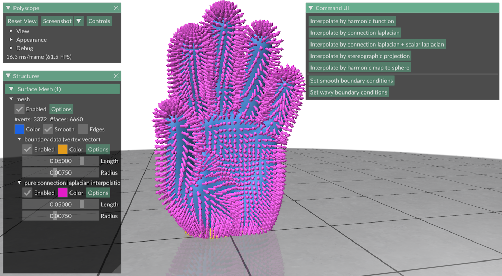
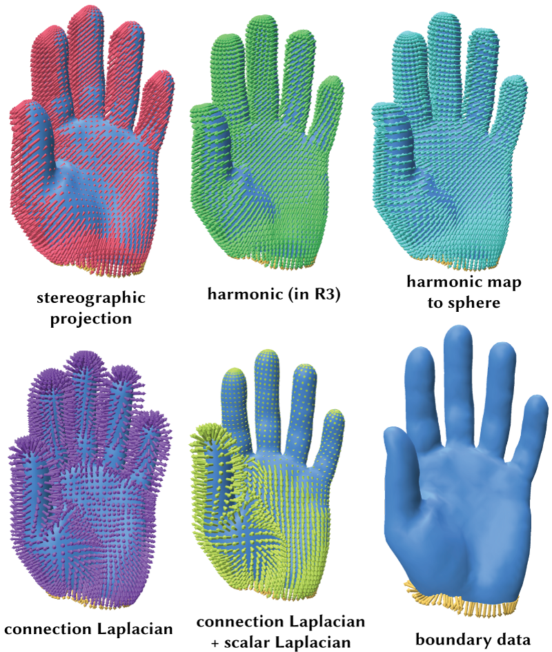

# Vector Interpolator

Try the online demo [here](https://markjgillespie.com/Demos/VectorInterpolation/html/)!



This repo provides a comparison of several different ways of interpolating 3D unit vector fields across a surface mesh given some data on the boundary. In general, all of the methods except for *connection Laplacian interpolation* seem to behave quite similarly, but using the connection Laplacian can yield very different results.


### Harmonic interpolation
Interpolates the 3 coordinates of the vector field independently via harmonic functions and normalizes the resulting vector field.

### Connection Laplacian interpolation
Splits the boundary data into a tangential vector field plus a normal component. The tangential field is interpolated by a harmonic tangent vector field (using the [connection Laplacian](http://geometry-central.net/surface/geometry/quantities/#vertex-connection-laplacian)). The normal component can either be chosen to make the resulting field a unit vector field, or can be interpolated separately by a separate scalar function. The latter option involves slightly more computation, but has the advantage of allowing the normal field to point into the surface and out of the surface at different points. 

### Stereographic projection
Uses stereographic projection to express the given unit vectors on the boundary as 2D vectors in the plane. Then interpolates those 2D vectors harmonically across the interior of the mesh, and uses inverse stereographic projection to obtain a unit vector field on the interior of the mesh.

### Harmonic map to the sphere
Computes a harmonic map to the unit sphere.


## Building
To compile the code, use
``` bash
mkdir build
cd build
cmake -DCMAKE_BUILD_TYPE=Release ..
```

### Javascript Version
This can also be compiled to Javascript via [Emscripten](https://emscripten.org/docs/getting_started/downloads.html).

After installing Emscripten, you may need to run the following command:
``` bash
source ~/emsdk/emsdk_env.sh
```

Then building this code is just like building an ordinary `geometry-central` project. Run the following commands from the `build` directory.
``` bash
emcmake cmake -DCMAKE_BUILD_TYPE=Release -DCMAKE_C_COMPILER=emcc -DCMAKE_CXX_COMPILER=em++ -DEMSCRIPTEN=True ..
emmake make -j7
```
This creates two "binaries", `bin/embind.js` and `bin/embind.wasm`. Then, you should copy these files into the `html` directory.

Because of some browser stuff, these `embind` files need to be served from a server - the page doesn't work if you just open the file locally.

Note that I had to include Eigen as an explicit dependency. Emscripten didn't like geometry-central's fancy on-the-fly Eigen downloader. But if you just include Eigen as a dependency everything works fine.

### Switching back from Javascript to local binaries
If you want to compile the ordinary command line version after building the javascript version, you have to tell CMake to use your C compiler again
``` bash
cmake -DCMAKE_BUILD_TYPE=Release -DCMAKE_C_COMPILER=gcc -DCMAKE_CXX_COMPILER=g++ -DEMSCRIPTEN=False ..
make -j7
```
